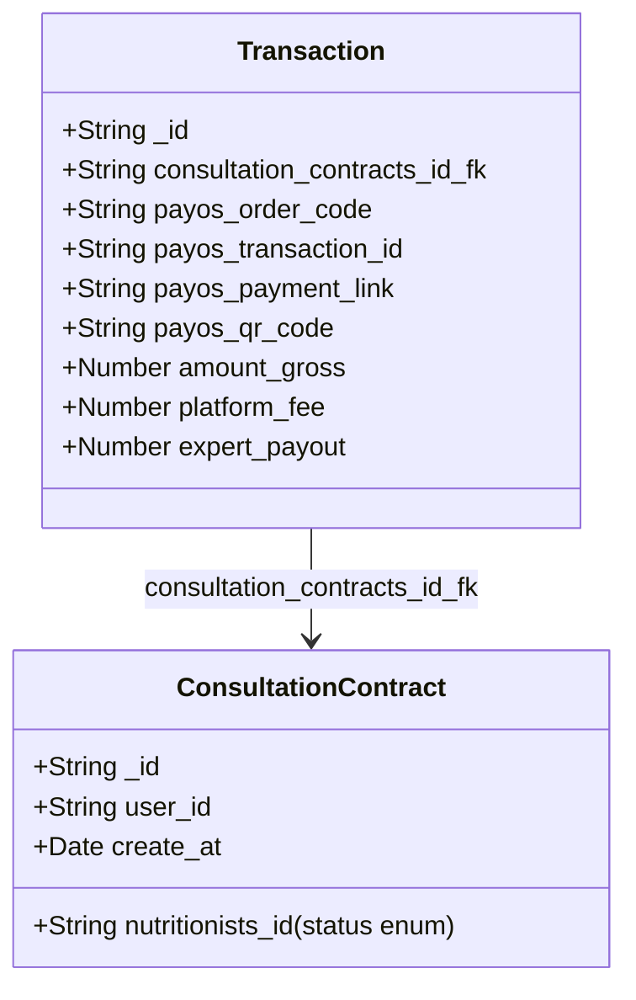

# PayOS Webhook Integration Specifications

Integrates consultation payments through the PayOS gateway to activate nutritionist bookings.

---

## 1. Associated Schemas

- **`ConsultationContract`**: Starts with status (`nutritionists_id`) set to `'pending_payment'`.
- **`Transaction`**: Contains payment link, unique QR code url, and the generated `payos_order_code` mapped to the transaction amount.

---

## 2. Webhook Endpoint Specification
- **URL**: `/api/webhooks/payos`
- **Method**: `POST`
- **Rate Limit**: Excluded from general rate limiting if needed, or configured with high threshold to guarantee delivery.

---

## 3. Detailed Logic Flow

### Step 1: Payload Parsing & Verification
1. Receive incoming POST payload containing `data` and `signature` properties from PayOS.
2. Validate payload structure. Check that signature matches the calculated HMAC-SHA256 signature using the system's `PAYOS_CHECKSUM_KEY` to guarantee authenticity.

### Step 2: Transaction Matching
1. Extract `orderCode` from the verified data block.
2. Find the corresponding `Transaction` in MongoDB matching the `payos_order_code`.
   - If not found, log error and return `404 Not Found`.

### Step 3: Idempotency & Verification Check
1. Read the matching `Transaction` state.
2. Check if `payos_transaction_id` is already populated. If populated, the transaction has already been processed (prevents double activation). Immediate response `200 OK` is returned.

### Step 4: Status Updates
1. Extract `transactionId` from the webhook payload.
2. Update the `Transaction` document:
   - Set `payos_transaction_id` = `webhook.transactionId`.
3. Fetch the linked `ConsultationContract` using the `consultation_contracts_id_fk` field:
   - Transition its status field (`nutritionists_id`) from `'pending_payment'` to `'active'`.
   - Update log or trace info in `AuditLog` collection.

### Step 5: Webhook Response
- Return `200 OK` with `{ success: true }` to PayOS to mark the webhook as handled successfully.
